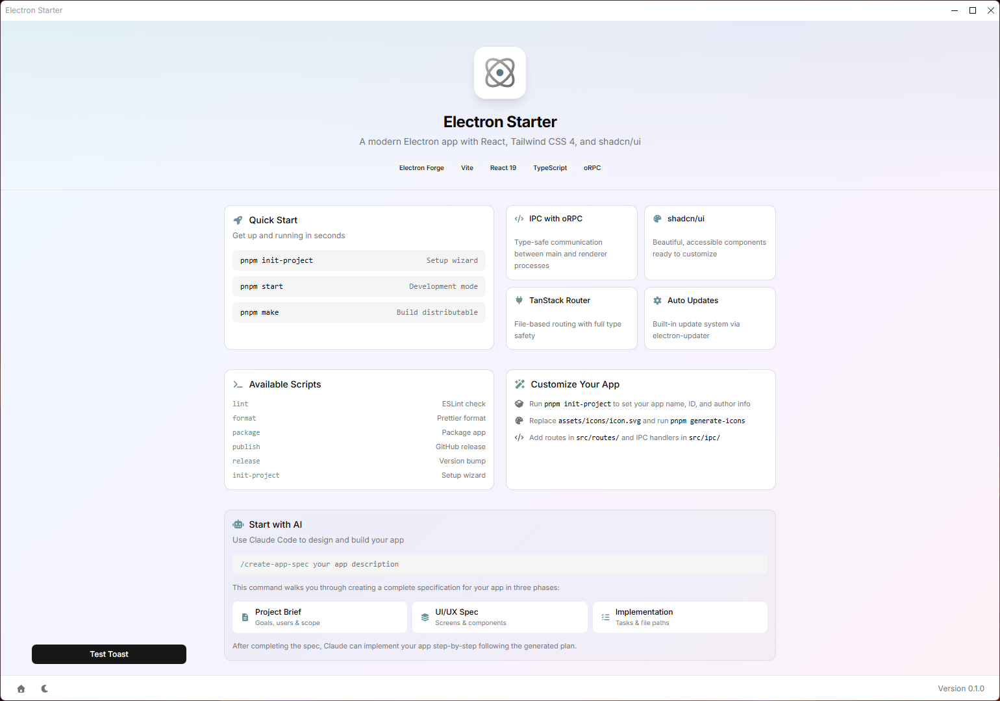

# Electron Starter

A modern Electron boilerplate with React, Tailwind CSS 4, and shadcn/ui — designed for rapid desktop app development with AI assistance.

<!-- Screenshot placeholder: Place your app screenshot at assets/screenshot.png -->


## Features

| Category | Technologies |
|----------|-------------|
| **Framework** | Electron 39, Electron Forge, Vite 7 |
| **UI** | React 19, TypeScript 5.9, Tailwind CSS 4, shadcn/ui |
| **Routing** | TanStack Router (file-based, fully typed) |
| **IPC** | oRPC (type-safe RPC over MessagePort) |
| **Updates** | electron-updater (GitHub Releases) |
| **Validation** | Zod 4 |

### Highlights

- **Type-safe IPC** — No more stringly-typed `ipcMain.handle`/`ipcRenderer.invoke`. oRPC provides full TypeScript inference across processes.
- **21+ UI components** — Pre-configured shadcn/ui components ready to use.
- **File-based routing** — Add a file to `src/routes/`, get a route automatically.
- **Auto-updates** — Built-in update system with progress UI, powered by GitHub Releases.
- **AI-ready** — Comprehensive documentation in `.context/` for Claude Code and other AI assistants.

---

## Quick Start

### 1. Create from Template

```bash
# Clone or use "Use this template" on GitHub
git clone https://github.com/cperuffo3/electron-starter.git my-app
cd my-app
pnpm install
```

### 2. Initialize Your Project

```bash
pnpm run init-project
```

This wizard configures:
- App name and display name
- Description
- GitHub owner/repo (for auto-updates)
- Author information

### 3. Start Development

```bash
pnpm run start
```

### 4. Generate Your App Icon

Replace `assets/icons/icon.svg` with your own, then:

```bash
pnpm run generate-icons
```

This creates `.ico`, `.icns`, and `.png` formats for all platforms.

---

## Build with AI

This starter is optimized for AI-assisted development with [Claude Code](https://claude.ai/code).

### Create Your App Specification

Run the slash command in Claude Code:

```
/create-app-spec your app description here
```

This guides you through creating three specification documents:

| Document | Purpose |
|----------|---------|
| `.context/PROJECT_BRIEF.md` | Goals, users, features, MVP scope |
| `.context/UI_UX_SPEC.md` | Screen layouts, components, design system |
| `.context/IMPLEMENTATION_PLAN.md` | Phased tasks with file paths |

After completing the spec, Claude can implement your app step-by-step following the generated plan.

### AI Documentation

The `.context/` folder contains comprehensive documentation:

- **STARTER_GUIDE.md** — How the boilerplate works, patterns, examples
- **PROJECT_BRIEF.md** — Template for your project specification
- **UI_UX_SPEC.md** — Template for design specifications
- **IMPLEMENTATION_PLAN.md** — Template for development roadmap

---

## Project Structure

```
src/
├── main.ts              # Electron main process
├── preload.ts           # Security bridge (contextBridge)
├── App.tsx              # React app entry
├── routes/              # TanStack Router pages (file-based)
│   ├── __root.tsx       # Root layout
│   └── index.tsx        # Home page (/)
├── components/
│   ├── ui/              # shadcn/ui components (21+)
│   └── ...              # App components
├── ipc/                 # IPC system
│   ├── manager.ts       # Client (renderer)
│   ├── handler.ts       # Server (main)
│   ├── router.ts        # Handler aggregation
│   └── <domain>/        # Handler domains (theme, window, etc.)
├── actions/             # Renderer-side IPC wrappers
├── layouts/             # Layout components
└── styles/              # Tailwind + design tokens
```

---

## Commands

### Development

```bash
pnpm run start              # Run in development mode
pnpm run lint               # ESLint check and fix
pnpm run format             # Prettier format
```

### Build & Package

```bash
pnpm run package            # Package for current platform
pnpm run make               # Create distributable installers
```

### Release

```bash
pnpm run release            # Interactive version bump
pnpm run release:patch      # 0.1.0 → 0.1.1
pnpm run release:minor      # 0.1.0 → 0.2.0
pnpm run release:major      # 0.1.0 → 1.0.0
```

### Utilities

```bash
pnpm run init-project              # Project setup wizard
pnpm run generate-icons            # Generate icons from SVG
pnpm run bump-shadcn-components    # Update shadcn/ui components
```

---

## IPC Pattern

Communication between main and renderer uses oRPC for full type safety:

```typescript
// 1. Create handler (src/ipc/myDomain/handlers.ts)
import { os } from "@orpc/server";
import { z } from "zod";

export const myHandler = os
  .input(z.object({ name: z.string() }))
  .handler(({ input }) => {
    return { greeting: `Hello, ${input.name}!` };
  });

// 2. Add to router (src/ipc/router.ts)
export const router = { ...existing, myDomain };

// 3. Create action (src/actions/myDomain.ts)
import { ipc } from "@/ipc/manager";
export const greet = (name: string) => ipc.client.myDomain.myHandler({ name });

// 4. Use in React
const result = await greet("World"); // Fully typed!
```

---

## Adding Routes

Create a file in `src/routes/`:

```typescript
// src/routes/settings.tsx
import { createFileRoute } from "@tanstack/react-router";

export const Route = createFileRoute("/settings")({
  component: () => (
    <div className="p-6">
      <h1 className="text-2xl font-bold">Settings</h1>
    </div>
  ),
});
```

The route tree is auto-generated. Navigate with:

```typescript
import { Link } from "@tanstack/react-router";
<Link to="/settings">Settings</Link>
```

---

## Releasing

This project uses [release-it](https://github.com/release-it/release-it) with GitHub Actions for multi-platform builds.

### Process

1. Run `pnpm run release` (or `release:patch`, `release:minor`, `release:major`)
2. The script validates code, bumps version, updates CHANGELOG, creates git tag
3. GitHub Actions builds for Windows and macOS
4. Release is published with installers attached

### Commit Format

Use [conventional commits](https://www.conventionalcommits.org/) for automatic changelog:

```
feat: add dark mode toggle     → Features
fix: resolve memory leak       → Bug Fixes
perf: optimize startup         → Performance
```

---

## Auto-Updates

The app automatically checks for updates from GitHub Releases on startup.

- Progress UI in bottom-right corner
- Manual check via footer button
- One-click download and install

### Private Repository Support

This starter fully supports auto-updates from **private GitHub repositories**:

1. **Enable private repo updates** in `package.json`:
   ```json
   "build": {
     "publish": {
       "provider": "github",
       "owner": "your-username",
       "repo": "your-repo",
       "private": true  // ← Add this
     }
   }
   ```

2. **Create a GitHub Personal Access Token**:
   - Go to GitHub → Settings → Developer settings → Personal access tokens → Fine-grained tokens
   - Generate new token with:
     - Repository access: Only select repositories → your repo
     - Permissions: Contents (Read/Write), Metadata (Read-only)
   - Copy the token (starts with `github_pat_...`)

3. **Add token to `.env`**:
   ```bash
   GH_TOKEN=github_pat_YOUR_TOKEN_HERE
   ```

4. **How it works**:
   - **Development**: Reads `GH_TOKEN` from `.env` file
   - **Production**: Uses `update-config.json` (auto-created by CI with `GITHUB_TOKEN`)
   - **CI/CD**: GitHub Actions bundles token during build process

### Windows Installer Notes

- Uses **WiX** (not Squirrel.Windows) for better reliability
- ✅ No ENOENT errors (no dependency on app-update.yml)
- ✅ Proper custom icon support
- ✅ Single update mechanism via electron-updater
- ✅ MSI installer with directory selection

---

## License

MIT
